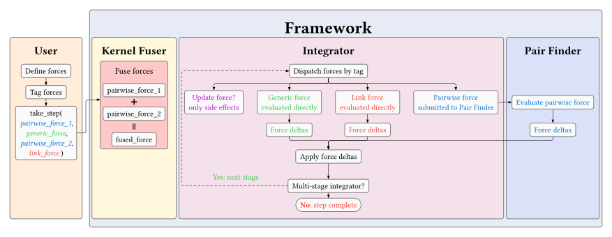

Forces
======

Forces define how agents evolve over time and form the core of all simulation behaviour in KoCS. They are responsible for updating simulation fields, applying pairwise interactions, introducing stochasticity and implementing custom dynamics.

KoCS distinguishes between four force categories, each with its own macro and kernel dispatch:

- ``GENERIC_FORCE`` - Operates independently on individual agents
- ``PAIRWISE_FORCE`` - Operates on every interacting neighbour pair from the ``PairFinder``
- ``UPDATE_FUNC`` - Operates on individual agents for side effects (link creation/destruction, proliferation)
- ``LINK_FORCE`` - Operates on explicitly managed connections (links) between agents

All force types are implemented as Kokkos-compatible lambda / functor kernels and are executed internally by the simulation's integrator.

Custom Forces
-------------

Custom forces are defined through the ``GENERIC_FORCE``, ``PAIRWISE_FORCE``, ``LINK_FORCE``, and ``UPDATE_FUNC`` macros. These macros automatically generate the function signatures, tag them and expose all simulation fields through a ``ctx`` reference wrapper.

All field updates inside a force must be written to the corresponding ``delta`` member rather than directly modifying the underlying field values. The framework accumulates these deltas internally before integration.

.. attention::
  
  Never use the assignment operator (``=``) when writing to delta or drag values. Since multiple forces may contribute to the same variable during a timestep, assignments can overwrite previous contributions. Always use additive opreation such as ``+=`` or ``-=`` instead.

Generic Force
^^^^^^^^^^^^^

``GENERIC_FORCE`` is used for agent self interactions that do not depend on neighbouring agents. Typical examples include stochastic motion, polarity alignment and internal state updates.

All simulation fields are automatically available through the ``ctx`` object:

.. code-block:: cpp

  // random motion
  auto generic_force = GENERIC_FORCE(
    ctx.position.delta += Vector(rng.normal(0, 1.0), rng.normal(0, 1.0), rng.normal(0, 1.0));
  );

Each field of the ``ctx`` object exposes a lightweight field wrapper with the following members for all fields defined in the simulation config:

- self - Read-only access to the current value of the field for agent ``i``
- delta - Accumulated change written by the force

Additional variables automatically available inside the force include:

- ``is_full_step`` - Read-only flag for multistage integrators
- ``int i`` - Read-only current agent index
- ``Random rng`` - Random number generator

PAIRWISE_FORCE
^^^^^^^^^^^^^^

``PAIRWISE_FORCE`` is used for interactions between neighbouring agents. These forces are evaluated for every interacting pair produced by the configured ``PairFinder``.

All simulation fields are automatically available through the ``ctx`` object:

.. code-block:: cpp

  auto pairwise_force = PAIRWISE_FORCE(
    ctx.position.delta += forces::PiecewiseLinear(displacement, distance, 0.7f, 0.8f);
    ctx.polarity.delta += bending_contribution;
  );

Each field of the ``ctx`` object exposes a lightweight wrapper with the following members for all fields defined in the simulation config:

- ``self`` - Read-only access to the field value of agent ``i``
- ``other`` - Read-only access to the field value of neighbouring agent ``j``
- ``delta`` - Accumulated change written by the interaction force

Additional variables automatically available inside the force include:

- ``unsigned int i`` - Read-only current agent index
- ``unsigned int j`` - Read-only neighbouring agent index
- ``Vector displacement`` - Read-only relative displacement vector from j to i
- ``Scalar distance`` - Read-only distance between agents i and j
- ``Random rng`` - Random number generator
- ``Scalar drag`` - Pairwise drag contribution for the current interaction

The drag parameter can be modified to introduce drag-weighted velocity coupling.

.. attention::

  ``delta`` and ``drag`` values are accumulated across all active pairwise interactions. Always use ``+=`` or ``-=`` when modying them. Using direct assignment (``=``) may overwrite previous contributions.

.. attention::

  ``PAIRWISE_FORCE`` does not evaluate self interactions. Interactions where ``i == j`` are never generated by the framework. Use a ``GENERIC_FORCE`` instead.

INIT_FUNC
^^^^^^^^^

``INIT_FUNC`` is used during initialization and provides a convenient mechanism for assigning additional agent state.

Unlike runtime forces, initialization functions do not use the ``ctx`` wrapper. Instead, fields are accessed directly through simulation views obtained from the simulation instance.

.. code-block:: cpp

  auto& positions_view = sim.get_view<FIELD(Vector, position)>();
  auto& polarities_view = sim.get_view<FIELD(Polarity, polaritie)>();

  auto init_func = INIT_FUNC() {
    polarities_view(i) = Polarity(positions_view(i));
  };

The following variables are available inside an ``INIT_FUNC``:

- ``unsigned int i`` - Read-only current agent index
- ``Random rng`` - Random number generator

Link Force
^^^^^^^^^^

``LINK_FORCE`` is used for interactions between two connected agents, where a link has been explicitly created and stored separately from the pair-finder. Unlike ``PAIRWISE_FORCE`` which operates on every neighbour pair discovered by the ``PairFinder``, ``LINK_FORCE`` only runs over the explicit link list - making it suitable for specialised persistent connections such as protrusions.

Each link stores the indices of its two endpoint agents. Inside the force kernel, both endpoints are accessible and can receive independent contributions.

All simulation fields are automatically available through the ``ctx`` object with endpoint-specific members:

.. code-block:: cpp

  auto link_force = LINK_FORCE(
    Vector displacement = ctx.position.b - ctx.position.a;
    Scalar distance = displacement.length();

    ctx.position.delta_a +=  link_strength * displacement / distance;
    ctx.position.delta_b += -link_strength * displacement / distance;
  );

Each field exposes a lightweight wrapper with the following members:

- ``a`` - Read-only access to the field value of endpoint agent ``a``
- ``b`` - Read-only access to the field value of endpoint agent ``b``
- ``delta_a`` - Accumulated change for endpoint ``a``
- ``delta_b`` - Accumulated change for endpoint ``b``

Additional variables automatically available inside the force include:

- ``bool is_full_step`` - ``true`` only once over all integration stages (useful for avoiding double-counting)
- ``Link link`` - The link connecting agents ``a`` and ``b``
- ``Random rng`` - Random number generator

Links must be managed separately. You can use the convenience function ``sim.run_links(func)`` to update the link list before the integration step:

.. code-block:: cpp

  sim.run_links(update_protrusions());
  sim.take_step(dt, link_force(), pairwise_force());

.. attention::

  ``LINK_FORCE`` does not evaluate self-interactions. Links where ``a == b`` are skipped automatically.

UPDATE_FUNC
^^^^^^^^^^^

``UPDATE_FUNC`` is used for **side-effect operations** - actions that modify the simulation structure rather than accumulating forces. Typical use cases include creating and destroying links and agent proliferation.

Unlike ``GENERIC_FORCE`` and ``PAIRWISE_FORCE``, an ``UPDATE_FUNC`` does **not** receive field references through the ``ctx`` wrapper. Instead, it accesses simulation data directly through views obtained from the simulation instance. This allows it to make arbitrary changes to the simulation.

.. code-block:: cpp

  auto& positions = sim.get_view<FIELD(Vector, position)>();
  auto& links = sim.get_links();

  auto update_protrusions = UPDATE_FUNC(
    Link& link = links(i);

    // destroy links that have drifted too far
    Scalar distance = positions(link.a).distance_to(positions(link.b));
    if (distance < min_link_length || distance > max_link_length) {
      link.a = 0;
      link.b = 0;
    }

    // create new links
    unsigned int new_a = (i + 0.5) / protrusions_per_cell;
    unsigned int new_b = rng.urand(agent_count - 1);
    if (new_a == new_b) return;

    Vector displacement = positions(new_a) - positions(new_b);
    distance = displacement.length();
    if (distance > min_link_length && distance < max_link_length) {
      link.a = new_a;
      link.b = new_b;
    }
  };

  sim.run_links(update_protrusions);

The following variables are available inside an ``UPDATE_FUNC``:

- ``unsigned int i`` - Read-only current link index
- ``Random rng`` - Random number generator

For operations like agent proliferation, the UPDATE_FUNC allocates new agents atomically. Use a ``DeviceVar<int>`` counter together with ``Kokkos::atomic_fetch_add`` to claim indices, then update ``sim.set_agent_count()`` afterwards:

.. code-block:: cpp

  DeviceVar<int> counter = sim.get_agent_count();
  auto proliferate = UPDATE_FUNC(
    // proliferation condition
    if (rng.drand(0.0, 1.0) > rate)
      return;

    int new_cell = Kokkos::atomic_fetch_add(counter.data(), 1);

    positions(new_cell) = positions(i) + Vector(rng.normal(0, 0.1));
    types(new_cell) = types(i);
  );

  sim.take_step(dt, cell_interaction());
  sim.run(proliferate());
  sim.set_agent_count(counter);

Predefined Forces
-----------------

KoCS includes a collection of predefined commonly used forces used in center based multicellular simulations. All predefined force implementations are available under the kocs::forces namespace.

Each predefined force is provided in two flavours:

- ``<ForceName>Potential`` - Returns a ``Scalar`` interaction magnitude or potential
- ``<ForceName>`` - Returns a ``Vector`` force using displacement normalization internally

The vector force variants are effectively shorthand for:

.. math::

  \mathbf{F} = \frac{\mathbf{r}_{ij}}{d_{ij}} \cdot P(...)

where :math:`\mathbf{r}_{ij}` is the displacement vector, :math:`d_{ij}` is the scalar distance between two agents, and :math:`P(...)` is the corresponding scalar potential or interaction magnitude.

Spring
^^^^^^

A linear spring interaction centered around the homeostatic equilibrium distance. Adhesive and repulsive behaviour are determined by the deviation from the homeostatic radius.

Potential formulation:

.. math::

  P(...) = \alpha \cdot (r_c - d_{ij})

where:

- :math:`d_{ij}` - Distance between agents :math:`i` and :math:`j`
- :math:`r_c` - Homeostatic radius
- :math:`\alpha` - Interaction scaling factor

Piecewise Linear
^^^^^^^^^^^^^^^^

A piecewiese linear interaction model combining short-range repulsion with long-range adhesion. Interaction regions are controlled independently through repulsion and adhesion radii.

Potential formulation:

.. math::

  P(...) = \alpha_{rep} \cdot \max(r_{rep} - d_{ij}, 0) - \alpha_{adh} \cdot \max(d_{ij} - r_{adh}, 0)

where:

- :math:`d_{ij}` - Distance between agents :math:`i` and :math:`j`
- :math:`r_{rep}` - Repulsion radius
- :math:`r_{adh}` - Adhesion radius
- :math:`\alpha_{rep}` - Repulsion scaling factor
- :math:`\alpha_{adh}` - Adhesion scaling factor

Piecewiese Quadratic
^^^^^^^^^^^^^^^^^^^^

A smooth piecewise quadratic interaction model supporting both repulsive and adhesive behaviour around a homeostatic equilibrium distance.

Potential formulation:

.. math::

  P(...) = \begin{cases}
    \alpha_{rep} \cdot (r_{ij} - r_c) (r_{ij} - r_{rep}), & r_{ij} < r_c, \\
    -\alpha_{adh} \cdot (r_{ij} - r_c) (r_{ij} - r_{adh}), & r_c \le r_{ij}, \\
  \end{cases}

where:

- :math:`d_{ij}` - Distance between agents :math:`i` and :math:`j`
- :math:`r_c` - Homeostatic radius
- :math:`r_{rep}` - Repulsion radius
- :math:`r_{adh}` - Adhesion radius
- :math:`\alpha_{rep}` - Repulsion scaling factor
- :math:`\alpha_{adh}` - Adhesion scaling factor

Cubic
^^^^^

A cubic interaction model with a cutoff distance, that smootly approaches zero at the cutoff distance.

Potential formulation:

.. math::

  P(...) = \alpha \cdot (d_{ij} - r_\delta)^2 (d_{ij} - r_c)

where:

- :math:`d_{ij}` - Distance between agents :math:`i` and :math:`j`
- :math:`r_c` - Homeostatic radius
- :math:`r_\delta` - Cutoff distance
- :math:`\alpha` - Interaction scaling factor

Morse
^^^^^

A Morse interaction model with exponentially decaying repulsion and adhesion regions.

Potential formulation:

.. math::

  P(...) = 2 \alpha \cdot (\exp(-2 \alpha_{rep}(d_{ij} - r_{rep})) - \exp(-\alpha_{adh}(d_{ij} - r_{adh})))

where:

- :math:`d_{ij}` - Distance between agents :math:`i` and :math:`j`
- :math:`r_{rep}` - Repulsion radius
- :math:`r_{adh}` - Adhesion radius
- :math:`\alpha_{rep}` - Repulsion decay coefficient
- :math:`\alpha_{adh}` - Adhesion decay coefficient
- :math:`\alpha` - Global interaction scaling factor

Lennard-Jones
^^^^^^^^^^^^^

A classical Lennard-Jones interaction potential.

Potential formulation:

.. math::

  P(...) = 4 \epsilon \cdot
  \left(
    \left(
      \frac{r_c}{d_{ij}}
    \right)^{12}
    -
    \left(
      \frac{r_c}{d_{ij}}
    \right)^6
  \right)

where:

- :math:`d_{ij}` - Distance between agents :math:`i` and :math:`j`
- :math:`r_c` - Length scale parameter
- :math:`\epsilon` - Interaction strength parameter

Hertz Contact
^^^^^^^^^^^^^

A Hertzian contact force model.

Potential formulation:

.. math::

  \frac{1}{E^*} &= \frac{1 - v_i^2}{E_i} + \frac{1 - v_j^2}{E_j} \\
  \frac{1}{R} &= \frac{1}{R_i} + \frac{1}{R_j} \\
  P(...) &= \frac{4}{3} E^* \sqrt{R^*} \delta_{ij}^{3/2}

where:

- :math:`\delta_{ij} = \max(r_c - r_{ij}, 0)` - Overlap between two agents :math:`i` and :math:`j`
- :math:`d_{ij}` - Distance between agents :math:`i` and :math:`j`
- :math:`r_c` - Homeostatic contact radius
- :math:`E_i, E_j` - Young's moduli of the interacting agents
- :math:`\nu_i, \nu_j` - Poisson ratios of the interacting agents
- :math:`R_i, R_j` - Effective radii of the interacting agents
- :math:`E^*` - Composite Young's modulus
- :math:`R^*` - Effective contact radius
